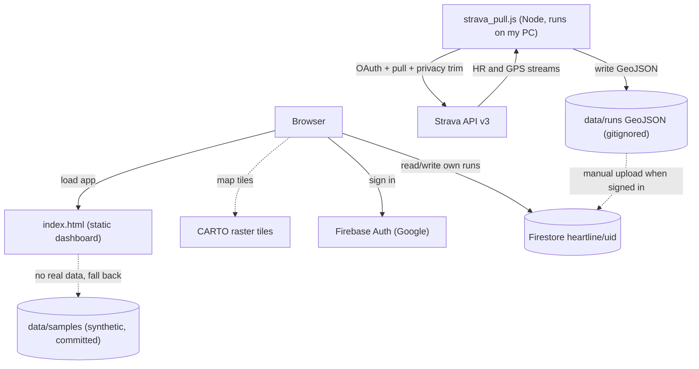
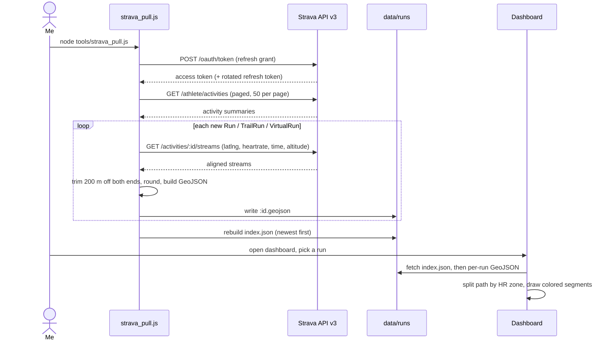

# Heartline

Heartline is a personal dashboard for my running. It pulls my activities from Strava, colors each route by heart-rate zone, and draws them on a map. Sign in with Google and the runs sync to Firestore, so I can open them on any device. It also overlays race-course GPX files, so I can lay a planned course over where I actually ran.

**Live: https://heartline.clayborne.dev** (no account needed). Signed-out visitors see synthetic sample runs, because my real activity data stays private for the reasons below.

The design choice I care most about: the app respects Strava's API terms and my own location privacy by default, not as a bolt-on. Strava only allows API activity data to be shown to the person who owns it, so real runs are never committed and never served from the public host. The collector also trims the first and last 200 meters of every route before it is written to disk, so my home does not sit at the visible end of a line.

<!-- SCREENSHOT / DEMO GIF GOES HERE -->
> **Demo placeholder:** add a screenshot of the map with a heart-rate-colored route and the run panel, plus a short GIF of picking a run and toggling the all-routes overlay.

## Problem, approach, result

**Problem.** I wanted to see my runs as heart-rate maps and check them from any device. Two constraints shaped the whole build. Strava's API Agreement says activity data pulled from the API may be shown only to the athlete who owns it, so I cannot publish a public page with my data baked in. And a GPS route drawn end to end quietly reveals where I live, since almost every run starts and finishes at my door.

**Approach.** Local-first. A small Node script does the Strava pull on my own machine and writes plain GeoJSON into a gitignored folder. Privacy trimming happens at collection time, before anything touches disk. The viewer is one static HTML file that reads those local files, or falls back to committed sample data when there are none. Cloud sync is opt-in and owner-scoped: Firestore rules only let a signed-in user read and write documents under their own uid, which is exactly the "owner only" condition Strava asks for.

**Result.** A dashboard that shows heart-rate-colored routes, per-run stats and charts, an all-routes overlay, and GPX course overlays. Public visitors see synthetic samples. I sign in to see my real data, pulled from Firestore. Nothing real ever lands in the repo or on the static host.

## Privacy and Strava terms (No-Publish Rules)

This app handles real activity data, so the privacy posture is part of the design, not a disclaimer. Under the Strava API Agreement (2024 revision), activity data obtained through the API may be displayed only to the athlete who owns it. That rules out publishing my real records anywhere public.

| Item | Published? |
|---|---|
| App code (`index.html`, `tools/`) | Yes |
| Synthetic samples (`data/samples/`) | Yes, they are fake |
| Real records (`data/runs/`) | Never. Enforced by `.gitignore` |
| Strava secrets (`tools/.env`) | Never. Enforced by `.gitignore` |
| My records in Firestore | Allowed. Rules permit read and write only for my own uid, which satisfies the owner-only rule |

What this means in practice:

- Real data is visible **only behind Google sign-in**. Firestore rules are the authentication gate. Anonymous visitors, and any other signed-in Google account, see the samples only.
- API data is **not** fed into any AI model. The Strava terms state this explicitly, and the pipeline has no such step.
- The collector trims 200 meters from the start and end of every route (`TRIM_METERS`) before writing it, so even my local files do not contain my home coordinates.
- The one terms-safe way to show a route to the public here is the GPX overlay, because those files are self-exported course data processed entirely in the browser, not Strava API data.
- The Firebase web config lives in the client, as it must for a static app. The API key there is a public project identifier, not a secret. Access is enforced by the Firestore rules, not by hiding the key.

## Architecture



There is no server of my own. The static files sit behind Caddy with TLS, the map tiles come from CARTO, and the only backend is Firestore, reached directly from the browser. The collector is a separate offline step that never runs on the host.

## The data pipeline



The pull is deliberately dull and repeatable. It requests an access token with the stored refresh token, pages through recent activities, keeps only the configured sport types (`Run,TrailRun,VirtualRun` by default), and skips anything it already has unless run with `--force`. For each new activity it fetches the aligned `latlng`, `heartrate`, `time`, and `altitude` streams in one call, trims the ends for privacy, rounds coordinates to six decimals and altitude to one, and writes a single GeoJSON file. A rebuilt `index.json` gives the viewer a fast list without opening every file.

## Key technical decisions and tradeoffs

- **Privacy trim at collection time.** `privacyTrim()` walks the track by cumulative distance and drops the points within 200 meters of each end, slicing the aligned HR, time, and altitude arrays the same way so everything stays index-aligned. It backs off when a run is too short to trim safely. The trimmed GeoJSON is the only version ever written, so the raw start point does not exist even in my local files. Tradeoff: the very start and end of a route are missing, which is the point.

- **Heart-rate coloring by path segment, not by marker.** `drawRun()` maps each sample to one of five zones from a configurable max HR (`run-hrmax`, default 190), then merges consecutive same-zone samples and draws each stretch as its own polyline over a dark casing line. The zones are under 60 percent of max (blue), 60 to 70 (green), 70 to 80 (amber), 80 to 90 (orange), and 90 or above (red). One route ends up showing effort along its length. It all draws through a Canvas renderer (`L.canvas`), so a run split into dozens of colored segments still pans smoothly.

- **Source-neutral GeoJSON contract.** The collector and the viewer only agree on a GeoJSON shape: a `LineString` plus a `streams` object. Strava is just the current producer. Anything that emits the same file, a Mi Fitness export or a future server-side job, can feed the same dashboard with no frontend change. Tradeoff: the contract is one more thing to keep stable, but it decouples the app from Strava.

- **Owner-scoped cloud, and the API key is not the boundary.** Cloud sync reuses an existing Firebase project, isolated in its own `heartline` collection. Access is enforced by Firestore rules that require `request.auth.uid == uid` on both the index document and each run document. That same rule is what makes cloud storage compatible with Strava's owner-only requirement. The Firebase SDK also loads on demand by dynamic `import()`, so a signed-out visit does not pay for it.

- **GeoJSON stored as a string in Firestore.** Firestore cannot store nested arrays, and a route is an array of coordinate pairs. Each run document keeps its GeoJSON as a JSON string and parses it on read. Documents over roughly 900 KB are skipped to stay under the 1 MB document limit. A typical run is well under that.

- **Refresh-token rotation is handled.** Strava rotates the refresh token on some token requests. `getAccessToken()` compares the returned token to the stored one and writes the new value back to `.env`, so an unattended pull does not quietly stop working a few days later.

- **A weakest-link check before trusting the data.** Heart rate reaches Strava through a chain: the watch, then Mi Fitness, then Strava, and any link can drop it. `node tools/strava_pull.js --check` pulls recent activities and prints whether the `latlng`, `heartrate`, `time`, and `altitude` streams are actually present, so I can confirm the pipeline works before relying on it.

- **Graceful fallbacks.** If the Firebase SDK fails to load, the handle stays null and the app runs offline on local or sample data. If `data/runs` is missing, which is the normal case on the public host, the viewer falls back to the committed samples and shows a badge. Map sizing is corrected on load and on `visibilitychange`, so the map is not blank when a background tab is restored.

## Tech stack

**Frontend:** one `index.html`, vanilla JavaScript in an IIFE, no framework and no build step. Leaflet 1.9.4 (from unpkg) for the map, CARTO raster tiles (voyager for light, dark_all for dark). Heart-rate and altitude charts are hand-drawn inline SVG, no chart library. Theming is CSS custom properties with light and dark modes, and the app shares `hub-theme` and `hub-lang` settings with sibling apps. Korean and English throughout.

**Cloud:** Firebase JS SDK 12.14.0, loaded on demand from gstatic. Firebase Auth with the Google popup provider, and Firestore configured with long-polling transport and a persistent local cache.

**Collector:** `tools/strava_pull.js`, Node 18 or newer (built-in `fetch`), zero dependencies. `tools/make_samples.js` generates the synthetic sample runs deterministically from a seeded PRNG.

**Hosting:** static files behind Caddy with TLS at `heartline.clayborne.dev`. No server process and no database of my own. The only backend is Firestore, called from the browser.

## Data model

`data/runs/{id}.geojson` is a GeoJSON Feature:

```
geometry:   LineString, coordinates [lon, lat][]
properties: id, name, sport_type, start_date, distance_m,
            moving_time_s, elapsed_time_s, elev_gain_m, avg_hr, max_hr,
            streams: { hr[], time_s[], alt_m[] }   // index-aligned with the coordinates
```

`data/runs/index.json` is `{ runs: [meta] }`, sorted newest first, where each meta carries `id`, `file`, `name`, `sport_type`, `start_date`, `distance_m`, `moving_time_s`, `elev_gain_m`, `avg_hr`, `max_hr`, and `has_hr`.

In Firestore the same shapes are keyed by user:

```
heartline/{uid}            = { runs: [meta], updated }
heartline/{uid}/runs/{id}  = { ...meta, geo: <GeoJSON as a JSON string> }
```

The GeoJSON is stringified because Firestore does not support nested arrays. This is intentionally the same shape a later server-side pipeline would write, so the frontend can be reused as is.

## Running it locally

You need Node 18 or newer (the collector relies on the built-in `fetch`).

**1. Register a Strava API app** at https://www.strava.com/settings/api, with Authorization Callback Domain set to `localhost`. Copy the Client ID and Client Secret.

**2. Configure:**

```bash
cd heartline
cp tools/.env.example tools/.env   # then fill in STRAVA_CLIENT_ID and STRAVA_CLIENT_SECRET
```

**3. Authorize once:**

```bash
node tools/strava_pull.js --auth              # open the printed URL, click Authorize
node tools/strava_pull.js --token <code>      # the code from the localhost redirect URL
```

**4. Check that heart rate actually arrives** (optional but worth it):

```bash
node tools/strava_pull.js --check
```

**5. Sync and view:**

```bash
node tools/strava_pull.js          # new runs -> data/runs/*.geojson
npx serve .                        # or any static server (needed because the app uses fetch)
```

With no `data/runs`, the dashboard shows the synthetic samples and a badge. To view real runs from another device, sign in with Google on the machine that has `data/runs`, upload, then sign in anywhere else.

Cloud sync needs Firestore rules that scope access to the owner:

```
match /heartline/{uid} {
  allow read, write: if request.auth != null && request.auth.uid == uid;
  match /runs/{runId} {
    allow read, write: if request.auth != null && request.auth.uid == uid;
  }
}
```

## Roadmap and known limitations

- **No automated tests.** The honest gap. The privacy trim and the GeoJSON conversion in `strava_pull.js` are the obvious first targets.
- **The pull is manual by design.** A webhook-driven pull (an API Gateway plus a worker that writes the same GeoJSON) is the planned next step. The source-neutral contract is what makes that a drop-in.
- **Cloud sync is one-way.** Upload pushes local runs the cloud does not have yet. There is no delete-from-cloud and no two-way merge.
- **Strava's 2026 developer-program change** now requires a paid subscription for standard API access. Because the contract is source-neutral, I can switch to a Mi Fitness export path without touching the frontend.
- **The GPX overlay draws straight lines** between trackpoints, which is fine for showing a course shape.
- **The Strava base URL changes** to `www.api-v3.strava.com` in 2027. That is a single line at the top of `strava_pull.js`.
